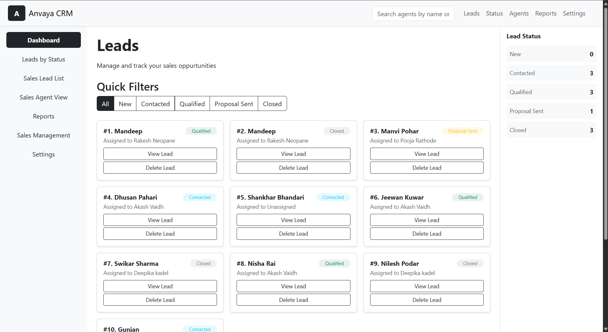
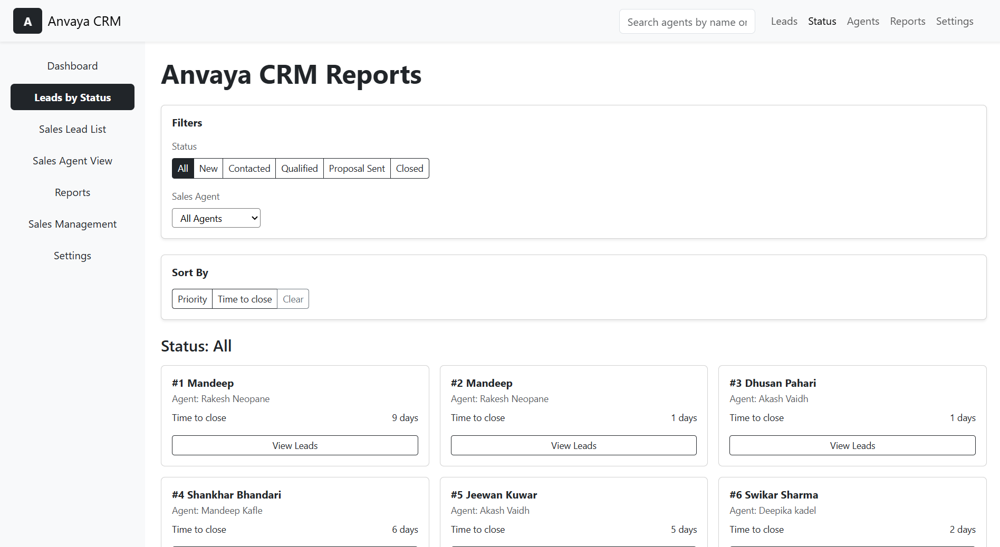
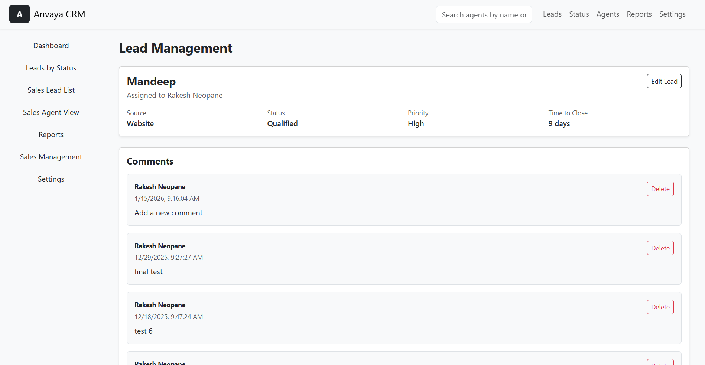
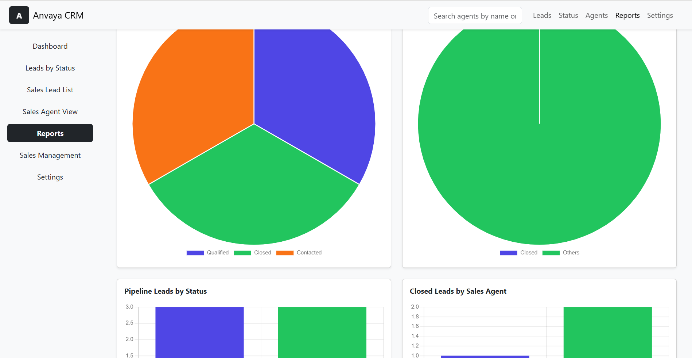

# Anvaya CRM System  

A full-stack Customer Relationship Management (CRM) application that helps manage customers, leads, and interactions efficiently.
Users can add, view, edit, and track customers, manage leads, and monitor follow-ups through a secure dashboard.

Built with a React frontend, Node.js/Express backend, and MongoDB database.

## 🌐 Demo Link

- Live Demo: https://crm-frontend-ten-nu.vercel.app/ <br/>
- Backend API: https://crm-backend-pi-six.vercel.app/

##⚡ Quick Start
```
git clone https://github.com/Rakeshneopane/CRM-frontend.git
cd crm-frontend
npm install
npm run dev
```

## Technologies
- React JS
- React Router
- Node.js
- Express
- MongoDB
- JavaScript (ES6+)
- REST APIs
- Bootstrap

## 🎥 Demo Video
Watch a walkthrough covering all major features of this CRM:
- Loom Video Link: https://www.loom.com/share/01ec0a872c6f4316ad0ecd71b48de80c

## ✨ Features
### Dashboard
- Views an overview of total leads, agents, and follow-ups
- Shows recent activity and quick actions

### Lead Management
- Views a list of all leads
- Searches customers by name or email in real time
- Adds new customers with contact details
- Creates and tracks leads
- Updates lead status (New, Contacted, Converted, Lost)
- Assigns notes and follow-up dates

### Lead Details
- Views complete customer information
- Edits customer details
- Views interaction history and comments

## 🔐 Environment Setup

### Frontend Environment Variables

Create a .env file in the root of the frontend project.
- VITE_API_BASE_URL=https://your-crm-backend-url.vercel.app

### Backend Environment Variables

#### Server
- PORT=4000
- NODE_ENV=development
#### Database
- MONGODB_URI=mongodb+srv://<username>:<password>@cluster.mongodb.net/anvaya 


**Restart the dev server after updating .env.**
# Add .env to .gitignore

## 📡 API Endpoints Used
### Agents
- POST /agents – Create a new agent
- GET /agents – Fetch all agents
- DELETE /agents/:id – Delete an agent

### Leads
- POST /lead – Create a new lead
- GET /leads – Fetch all leads
- GET /lead/:id – Fetch lead by ID
- PUT /lead/:id – Update lead
- DELETE /lead/:id – Delete lead

### Lead Comments
- POST /lead/:id/comments – Add a comment
- GET /lead/:id/comments – Fetch comments
- DELETE /lead/:leadId/comments/:commentId – Delete comment

### Tags
- POST /tags – Create a tag
- GET /tags – Fetch all tags
- DELETE /tags/:id – Delete a tag

### Sample Response
```
{
  "leads": [
    {
      "_id": "6940dd24cde32b58fd39a82e",
      "name": "Mandeep",
      "source": "Website",
      "salesAgent": {
        "_id": "6937a904523abc334872ede1",
        "name": "Rakesh Neopane",
        "email": "rakeshCRM@gmal.com",
        "createdAt": "2025-12-09T04:43:48.979Z",
        "__v": 0
      },
      "status": "Qualified",
      "tags": [
        {
          "_id": "694facd03f1aab1620f17c59",
          "name": "Follow-up",
          "createdAt": "2025-12-27T09:54:24.477Z",
          "__v": 0
        }
      ],
      "timeToClose": 9,
      "priority": "High",
      "createdAt": "2025-12-16T04:16:36.453Z",
      "updatedAt": "2025-12-16T04:16:36.456Z",
      "__v": 0
    }
  ]
}
```

## Screen Shots






## 🚀 Future Improvements
- JWT based Authentication
- Role-based access control (Admin, Sales, Support)
- Email and notification reminders for follow-ups
- Advanced analytics and reporting dashboard
- Import/export customers via CSV

## 📬 Contact

For bugs, feedback, or feature requests, please reach out to:
📧 rakeshneopane@gmail.com
 or lucasneopane123@gmail.com <br/>
LinkedIn: https://linkedin.com/in/rakesh-neopane
